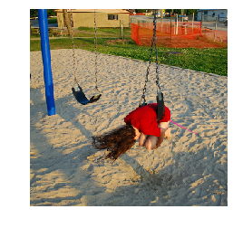
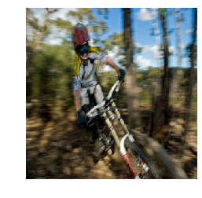

# Image-Captioning
Generate Captions for images using Encoder, Decoder model.

Using the datasets **Flickr8k** from University of Ilinois, neural network was trained to generate the captions for the images.
The model is built on Keras with Tensorflow 2.0 beta.

# How Image Captioning works ->
The task of image captioning can be divided into two modules logically – one is an image based model – which extracts the features and nuances out of our image, and the other is a language based model – which translates the features and objects given by our image based model to a natural sentence.

For our image based model (viz encoder) – we usually rely on a Convolutional Neural Network model. And for our language based model (viz decoder) – we rely on a Recurrent Neural Network. The image below summarizes the approach given above.

Usually, a pretrained CNN extracts the features from our input image. The feature vector is linearly transformed to have the same dimension as the input dimension of the RNN/LSTM network. This network is trained as a language model on our feature vector.

For training our LSTM model, we predefine our label and target text.

## Captions generated for the test set by the model
Image | Caption Provied | Generated Caption 
---|---|---
|<ul><li>a child is jumping into a swimming pool</li><li>a little boy in black shorts jumps into a backyard pool next to a yellow stucco house </li><li>a little boy jumps high above the swimming pool with a man in the background</li> <li>the boy jumps into the blue pool</li> <li>young child in midair descending into pool</li></ul>| a boy jumps into a pool
|<ul><li>a group of girls dancing on a stage</li><li>a group of teenage girls do a synchronized dance in hanna montana costumes </li><li> girls in a line do a dance </li><li> the girls are dancing and wearing leather outfits </li><li> young girls in dancing outfits perform on a stage </li> | a group of people are dancing on the street
|<ul><li>a girl crouched up over a swing at the park  spinning around <li>a girl is kneeling on a swing at the park </li> <li> a girl with a red shirt and long brown hair is laying across a twisted swing with sand underneath </li> <li> a young girl in a red shirt swings face down on the swings </li> <li> girl is playing at park on a swing </li></ul>|a child swinging on a swing 
| <ul><li>greyhounds racing on a track</li><li>a greyhound race with the lead dog wearing yellow and black stripes and the number</li><li>dogs racing at a track</li><li>greyhound dogs race on the track  with   leading the way</li><li>some greyhound dogs are racing on a dirt track </li></ul> | dogs are racing
|<ul><li>a child wearing a helmet riding a mountain bike very fast through a forest </li><li> a cyclist streaks through the trees</li><li> a person wearing a red helmet riding a white bike </li><li> a person wearing a red helmet and yellow and white clothing is riding a bike outside in a wooded area </li><li>the bmx biker rides through the forest </li></ul>| a man in a helmet is riding a bike in the woods
  
  ## Captions generated for Images outside the datasets
  Image | Captions
  ---|---
  | people are watching hot air balloons in the street
  | a man in a yellow kayak is holding a paddle 
  | a crowd of people are gathered around a track
  | a man in a blue shirt is walking on the rocks by a lake 
